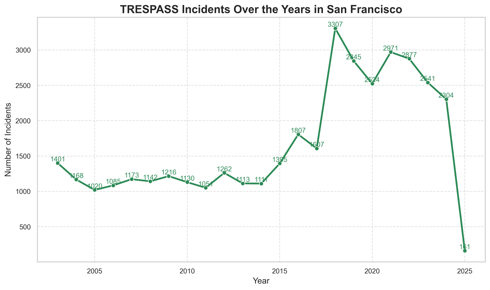

#  Welcome to Group 28's Website - Assignment 2

    Yunxuan Li - s232900

    Senhao Zou - s242606

    Xiaosa Liu - s242649

Welcome! On this page, we present a short data story about **TRESPASS crimes** in San Francisco.  
Our visualizations aim to reveal spatial, temporal, and interactive patterns based on real crime data.

---

##  Figure 1: TRESPASS Crimes by Year

This time series chart shows how the number of trespass incidents has changed over time from 2003 to 2025.

When analyzing San Francisco crime data, we saw a significant “spike” in 2018, when the number of crimes rose rapidly. This was followed by a gradual decline from 2019 onwards, creating a clear “up then down” trend. According to news reports [https://hoodline.com/2018/11/calls-to-sfpd-down-from-last-year-trespassing-and-noise-complaints-tick-up/](https://hoodline.com/2018/11/calls-to-sfpd-down-from-last-year-trespassing-and-noise-complaints-tick-up/) some types of crime in San Francisco did experience a significant rise in 2018.

Factors contributing to the high incidence of these cases may include:
1. an increase in the incidence of other types of crime, leading criminals to be more brazen in attempting other types of crime, such as TRESPASS.
After researching we found that '17 and '18 were the most rampant years for the car smash and grab problem in San Francisco, equating to 85 cases per day. Shockingly, out of those 30,000+ smash-and-grab cases, police arrested suspects in only 550 cases, a solving rate of less than 2%. This may have accelerated the catalyst for other types of crime [https://www.kqed.org/news/11643054/car-breaks-ins-are-up-in-san-francisco-whats-being-done](https://www.kqed.org/news/11643054/car-breaks-ins-are-up-in-san-francisco-whats-being-done)

2. 2014's Prop 47 referendum gave criminals plenty of confidence [https://www.latimes.com/california/story/2024-08-12/what-is-california-proposition-47-how-proposition-](https://www.latimes.com/california/story/2024-08-12/what-is-california-proposition-47-how-proposition-) 36-could-change-crime-sentencing-drugs-theft)

3. increase in homelessness

---

## 🗺 Figure 2: Heatmap Animation of TRESPASS

This animated heatmap illustrates the **geographic distribution of trespass crimes**, year by year.  
Each frame shows hot zones where incidents were most frequent.

<iframe src="trespass_heatmap_by_year.html"
        style="width: 100%; max-width: 960px; height: 520px; margin: auto; display: block; border: none;"></iframe>

Based on the heat map we can find:
MISSION and its northeastern geographic areas have a higher crime heat, and one possible extrapolation is that the homeless people involved in the downtown area of vehicular crime are aiming their next target at the wealthy areas not far away.

---

##  Figure 3: Interactive Bokeh Explorer

Use the dropdown and slider to explore **where and when** trespass crimes occurred across different police districts.

<iframe src="bokeh_trespass_interactive.html"
        style="width: 100%; max-width: 960px; height: 620px; margin: auto; display: block; border: none;"></iframe>

As we analyze the situation by district, the answers emerge (please select Mission District).
The severe homeless problem has brought not only random urination and defecation to the streets of San Francisco, but also a large number of property crimes, with car smashes and supermarket robberies being the most direct results.The Mission District is a busy commercial area in downtown San Francisco, but it is also one of the areas where property crimes are most prevalent. [https://sfchamber.com/public-safety-homelessness-affordability-biggest-issues-2018-sf-chamber-poll/](https://sfchamber.com/public-safety-homelessness-affordability-biggest-issues-2018-sf-chamber-poll/) As a result of the widening gap between the rich and the poor, rents have skyrocketed, and San Francisco's homeless population has also increased dramatically in recent years, with the number of homeless people in San Francisco increasing by 17 percent from 2017 to 2020. The city has more than 8,000 homeless people sleeping on the streets year-round, with tents staked out on either side of the sidewalk. This confirms our suspicion that there is a strong correlation between crime “spikes” and homelessness in the context of the Prop 47 referendum.

---

###  Summary

Together, these visualizations help us uncover how TRESPASS crimes evolved across time and space in San Francisco.  
The interactive explorer empowers viewers to dive deeper into their districts of interest.

---
